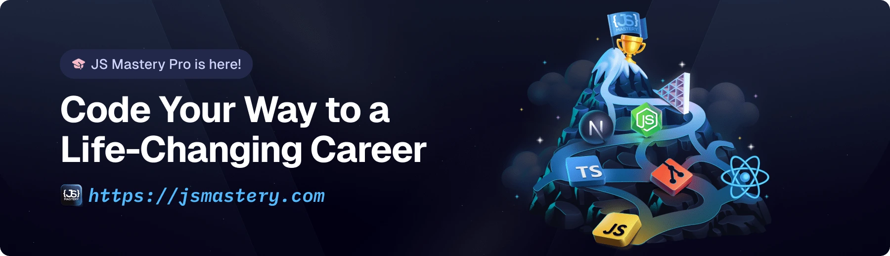

<div align="center">
  <br />
    <h1>HODL - Advanced Stock & Crypto Tracker</h1>
  <br />

  <div>
    
    
    <br/>

    
    
    
    <br/>

    
    
    
    

  </div>

  <h3 align="center">🏆 START HACK 2025 Submission — Advanced Portfolio Tracker with Base Integration</h3>

   <div align="center">
     <strong>Team HODL</strong> presents an AI-powered stock & crypto tracking platform with seamless Base blockchain integration for the next generation of traders and investors.
    </div>
</div>

## 📋 <a name="table">Table of Contents</a>

1. ✨ [Introduction](#introduction)
2. ⚙️ [Tech Stack](#tech-stack)
3. 🔋 [Features](#features)
4. 🤸 [Quick Start](#quick-start)
5. 🔗 [Assets](#links)
6. 🚀 [More](#more)

## 🏆 START HACK 2025

**Team HODL** is participating in START HACK 2025, collaborating with Base (Coinbase's Layer 2 blockchain) to build the future of decentralized finance and trading platforms.

Our mission: Create a comprehensive stock and crypto tracking platform that bridges traditional finance with Web3, powered by Base's fast, secure, and low-cost blockchain infrastructure.

## <a name="introduction">✨ Introduction</a>

**HODL** is an AI-powered financial tracking platform that combines traditional stock market data with cryptocurrency insights, all integrated with Base blockchain for seamless Web3 functionality. Built for the next generation of traders and investors who want the best of both traditional and decentralized finance.

### 🎯 **Hackathon Vision**
- **Unified Portfolio Tracking**: Seamlessly track both traditional stocks and cryptocurrencies
- **Base Integration**: Leverage Base's Layer 2 scaling for fast, cheap transactions
- **AI-Powered Insights**: Get personalized market analysis and trading recommendations
- **Real-Time Alerts**: Never miss important market movements with smart notifications
- **Web3 Ready**: Built for the decentralized future of finance

### 🚀 **Why HODL?**
In the crypto world, "HODL" means to hold onto your investments through market volatility. Our platform helps you make informed decisions about when to HODL and when to act, whether you're trading stocks or crypto.

## <a name="tech-stack">⚙️ Tech Stack</a>

- **[Better Auth](https://www.better-auth.com/)** is a framework-agnostic authentication and authorization library for TypeScript. It provides built-in support for email/password login, social sign-on (Google, GitHub, Apple, and more), and multi-factor authentication, simplifying user authentication and account management.

- **[CodeRabbit](https://jsm.dev/stocks-coderabbit)** is an AI-powered code review assistant that integrates with GitHub. It helps developers catch bugs, enforce best practices, and maintain consistent code quality across pull requests, reducing manual review effort and speeding up the development workflow.


- **[Finnhub](https://finnhub.io/)** is a real-time financial data API that provides stock, forex, and cryptocurrency market data. It offers developers access to fundamental data, economic indicators, and news, making it useful for building trading apps, dashboards, and financial analysis tools.

- **[Inngest](https://jsm.dev/stocks-inngest)** is a platform for event-driven workflows and background jobs. It allows developers to build reliable, scalable automated processes such as real-time alerts, notifications, and AI-powered workflows.

- **[MongoDB](https://www.mongodb.com/)** is a flexible, high-performance NoSQL database. It stores data in JSON-like documents, supports dynamic schemas, and provides robust features for scalability, replication, and querying.

- **[Nodemailer](https://nodemailer.com/)** is a Node.js library for sending emails easily. It supports various transport methods such as SMTP, OAuth2, and third-party services, making it a reliable tool for handling transactional emails, notifications, and contact forms in applications.

- **[Next.js](https://nextjs.org/docs)** is a powerful React framework for building full-stack web applications. It provides server-side rendering, static site generation, and API routes, allowing developers to create optimized and scalable apps quickly.

- **[Shadcn](https://ui.shadcn.com/docs)** is an open-source library of fully customizable, accessible React components. It helps teams rapidly build consistent, visually appealing UIs while allowing full control over design and layout.

- **[TailwindCSS](https://tailwindcss.com/)** is a utility-first CSS framework that allows developers to build custom, responsive designs quickly without leaving their HTML. It provides pre-defined classes for layout, typography, colors, and more.

- **[TypeScript](https://www.typescriptlang.org/)** is a statically typed superset of JavaScript that improves code quality, tooling, and error detection. It is ideal for building large-scale applications and enhances maintainability.

## <a name="features">🔋 Features</a>

### 📊 **Traditional Finance**
👉 **Stock Dashboard**: Track real-time stock prices with interactive line and candlestick charts, including historical data, and filter stocks by industry, performance, or market cap.

👉 **Powerful Search**: Quickly find the best stocks with an intelligent search system that helps you navigate through HODL.

👉 **Watchlist & Alerts**: Create a personalized watchlist, set alert thresholds for price changes or volume spikes, and receive instant email notifications to stay on top of the market.

👉 **Company Insights**: Explore detailed financial data such as PE ratio, EPS, revenue, recent news, filings, analyst ratings, and sentiment scores for informed decision-making.

### 🪙 **Crypto & Web3 Integration**
👉 **Base Chain Integration**: Seamlessly interact with Base blockchain for fast, low-cost transactions and DeFi protocols.

👉 **Crypto Portfolio Tracking**: Monitor your cryptocurrency holdings alongside traditional stocks in a unified dashboard.

👉 **DeFi Protocol Integration**: Connect with Base-based DeFi protocols for yield farming, liquidity provision, and decentralized trading.

👉 **Cross-Chain Asset Management**: Manage assets across different chains with Base as your primary Layer 2 hub.

### 🤖 **AI & Automation**
👉 **Real-Time Workflows**: Powered by **Inngest**, automate event-driven processes like price updates, alert scheduling, automated reporting, and AI-driven insights.

👉 **AI-Powered Alerts & Summaries**: Generate personalized market summaries, daily digests, and earnings report notifications, helping users track performance and make data-driven decisions.

👉 **Smart Trading Insights**: Get AI recommendations on when to HODL vs. when to trade based on market sentiment and technical analysis.

👉 **Customizable Notifications**: Fine-tune alerts and notifications based on user watchlists and preferences for a highly personalized experience.

### 📈 **Analytics & Insights**
👉 **Unified Portfolio Analytics**: Gain insights into your combined stock and crypto portfolio performance.

👉 **Market Sentiment Analysis**: Track both traditional and crypto market sentiment with AI-powered analysis.

👉 **Risk Assessment**: Get comprehensive risk analysis across your entire portfolio including both traditional and digital assets.

## <a name="quick-start">🤸 Quick Start</a>

### 🚀 **GitHub Repository**

**Repository**: [github.com/YOUR_USERNAME/hodl-portfolio-tracker](https://github.com/YOUR_USERNAME/hodl-portfolio-tracker)  
**Live Demo**: [Coming Soon]  
**Hackathon**: START HACK 2025 - Team HODL

### 📥 **Clone the Repository**

```bash
git clone https://github.com/YOUR_USERNAME/hodl-portfolio-tracker.git
cd hodl-portfolio-tracker
```

Follow these steps to set up the project locally on your machine.

**Prerequisites**

Make sure you have the following installed on your machine:

- [Git](https://git-scm.com/)
- [Node.js](https://nodejs.org/en)
- [npm](https://www.npmjs.com/) (Node Package Manager)

**Cloning the Repository**

```bash
git clone https://github.com/adrianhajdin/signalist_stock-tracker-app.git
cd signalist_stock-tracker-app
```

**Installation**

Install the project dependencies using npm:

```bash
npm install
```

**Set Up Environment Variables**

Create a new file named `.env` in the root of your project and add the following content:

```env
NODE_ENV='development'
NEXT_PUBLIC_BASE_URL=http://localhost:3000

# FINNHUB
NEXT_PUBLIC_NEXT_PUBLIC_FINNHUB_API_KEY=
FINNHUB_BASE_URL=https://finnhub.io/api/v1

# MONGODB
MONGODB_URI=

# BETTER AUTH
BETTER_AUTH_SECRET=
BETTER_AUTH_URL=http://localhost:3000

# GEMINI
GEMINI_API_KEY=

#NODEMAILER
NODEMAILER_EMAIL=
NODEMAILER_PASSWORD=

# BASE CHAIN INTEGRATION
NEXT_PUBLIC_BASE_RPC_URL=https://mainnet.base.org
NEXT_PUBLIC_BASE_CHAIN_ID=8453
NEXT_PUBLIC_BASE_EXPLORER_URL=https://basescan.org
NEXT_PUBLIC_ALCHEMY_API_KEY=
NEXT_PUBLIC_WALLET_CONNECT_PROJECT_ID=
```

Replace the placeholder values with your real credentials. You can get these by signing up at: [**MongoDB**](https://www.mongodb.com/products/platform/atlas-database), [**Gemini**](https://aistudio.google.com/prompts/new_chat?utm_source=chatgpt.com), [**Inngest**](https://jsm.dev/stocks-inggest), [**Finnhub**](https://finnhub.io), [**Alchemy**](https://www.alchemy.com/), [**WalletConnect**](https://cloud.walletconnect.com/).

## <a name="base-integration">🔗 Base Integration</a>

- **[Base](https://base.org/)** is Coinbase's Layer 2 blockchain built on Ethereum. It provides fast, secure, and low-cost transactions while maintaining Ethereum's security. Base serves as the perfect foundation for our Web3 features including crypto portfolio tracking, DeFi protocol integration, and cross-chain asset management.

- **[Alchemy](https://www.alchemy.com/)** provides reliable RPC endpoints and enhanced APIs for blockchain data access, enabling real-time portfolio tracking and transaction monitoring on Base.

- **[WalletConnect](https://walletconnect.com/)** enables seamless wallet connections, allowing users to connect their existing crypto wallets (MetaMask, Coinbase Wallet, etc.) to interact with Base protocols directly from our platform.

**Running the Project**

```bash
npm run dev
npx inngest-cli@latest dev
```

Open [http://localhost:3000](http://localhost:3000) in your browser to view the project.

### 🔄 **Development Workflow**

```bash
# Switch to hackathon development branch
git checkout hackathon-development

# Make your changes, then commit
git add .
git commit -m "✨ Add new feature for hackathon"

# Push to GitHub
git push origin hackathon-development

# Create a pull request for review
# Merge to main when ready for demo
```

## 🏆 START HACK 2025 - Team HODL

### 🎯 **Our Mission**
We're building the future of portfolio management by bridging traditional finance with Web3. HODL combines the best of both worlds - professional stock market analysis with cutting-edge blockchain technology powered by Base.

### 🚀 **Why We Chose Base**
- **Low Transaction Costs**: Perfect for frequent portfolio updates and DeFi interactions
- **Fast Transactions**: Real-time portfolio tracking without delays
- **Ethereum Security**: Leveraging Ethereum's battle-tested security model
- **Growing Ecosystem**: Access to emerging DeFi protocols and tokens
- **Coinbase Integration**: Seamless connection with Coinbase's ecosystem

### 💡 **Innovation Highlights**
1. **Unified Dashboard**: Track stocks and crypto in one place
2. **AI-Powered Insights**: Get personalized recommendations for both traditional and digital assets
3. **DeFi Integration**: Access yield farming and liquidity protocols directly from the platform
4. **Cross-Asset Analytics**: Understand correlations between traditional and crypto markets
5. **Smart Notifications**: Get alerts for both stock price movements and DeFi opportunities

### 🛠 **Technical Innovation**
- **Hybrid Architecture**: Traditional REST APIs + Web3 blockchain interactions
- **Real-time Sync**: Instant portfolio updates across all asset types
- **Event-Driven Workflows**: Automated alerts and insights powered by Inngest
- **AI Integration**: Gemini-powered market analysis and recommendations
- **Responsive Design**: Optimized for both desktop and mobile trading

### 📊 **Demo Features**
- Connect your wallet to track Base-based assets
- View real-time stock prices alongside crypto holdings
- Set up alerts for both traditional and digital assets
- Get AI-powered market insights and trading recommendations
- Explore DeFi opportunities on Base protocol

## <a name="links">🔗 Assets</a>

Assets and snippets used in the project can be found in the **[video kit](https://jsm.dev/stocks-kit)**.

<a href="https://jsm.dev/stocks-kit" target="_blank">
  
</a>

## <a name="more">🚀 More</a>

**Advance your skills with Next.js Pro Course**

Enjoyed creating this project? Dive deeper into our PRO courses for a richer learning adventure. They're packed with
detailed explanations, cool features, and exercises to boost your skills. Give it a go!

<a href="https://jsm.dev/stocks-jsmpro" target="_blank">
  
</a>
